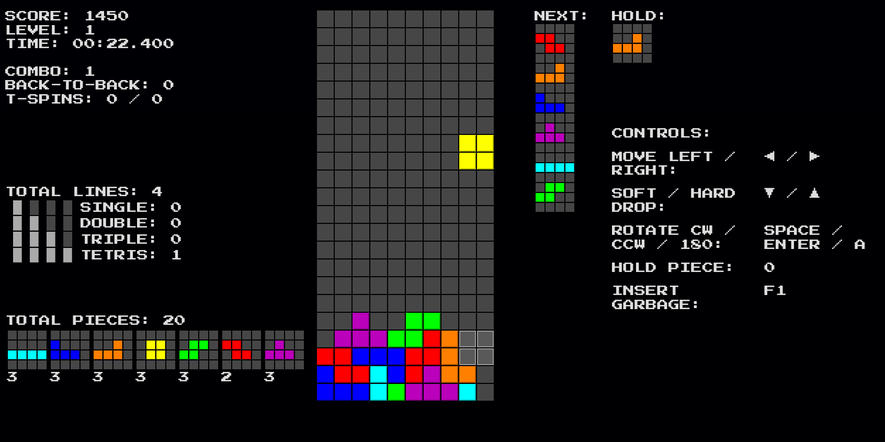

# Tetris in Vue + TypeScript

This is a Tetris Game fully written in Vue + TypeScript.  
In large part compliant with the [Tetris Guidelines](https://tetris.fandom.com/wiki/Tetris_Guideline).

You can play this game at: https://yet-another-tetris.vercel.app/

## Tetris Guidelines Implemented

-   ✅ Super Rotation System with Wallkicks (+180° Rotations)
-   ✅ 7-bag Random Generator (+ No-Overhang Option) & True Random Generator
-   ✅ Endless Mode, Marathon Mode (150 Lines), Sprint Mode (40 Lines), Time Trial (3:00)
-   ✅ Remappable Controls
-   ✅ Next Piece Preview
-   ✅ Hold Piece
-   ✅ Guideline Scoring System
-   ✅ NES-Style Gravity
-   ✅ T-Spins
-   ✅ Back-to-Backs
-   ✅ Combos
-   ✅ Toggleable Ghost Piece
-   ✅ Configurable Lock Delay & Move Resets
-   ✅ Modifiable Line Clear Delay
-   ✅ Customizable DAS & ARR
-   ✅ Sound Effects
-   ✅ Countdown

-   🆕 Inserting Garbage in Single Player

## Running locally

1. Clone the repository
2. Install the dependencies with `npm install`
3. Run the dev server with `npm run dev`
4. Open [localhost:5173](http://localhost:5173) in your browser
